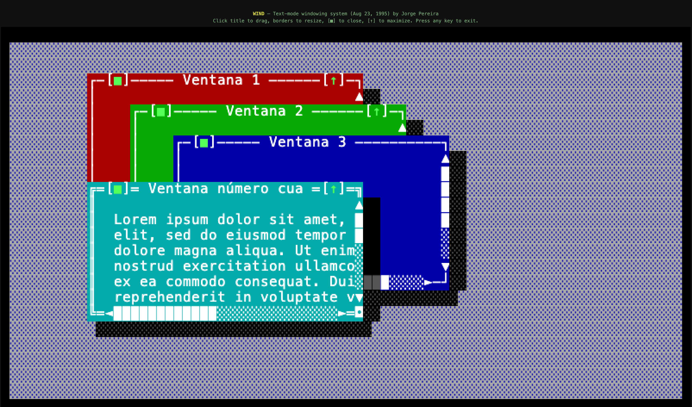
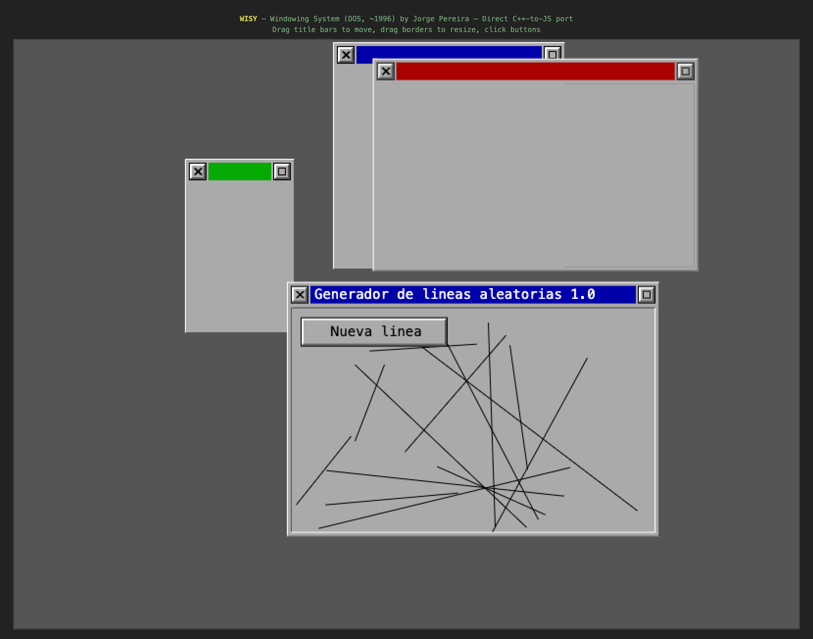

# graveyard

A collection of old personal projects I've archived here. These are experiments, side projects, and one-off scripts that are no longer actively maintained but preserved for posterity.

## Projects

### belringer
An Android app (Java/Kotlin) that renders interactive 3D city maps using OpenGL. Features dual camera modes (aerial and chase), custom GLSL shaders, and vector-based city rendering with roads, parks, and water.

### piggy-bank
A SwiftUI iOS app for kids to track their savings and allowance. Supports multiple profiles, transaction history, balance charts, and themed interfaces. Built with MVVM architecture targeting iOS 15+.

### running_log
A Jupyter notebook for visualizing 2020 US election results -- vote margins and remaining ballots across battleground states (Georgia, Arizona, Nevada, Pennsylvania).

### voice-test
A Python project for real-time speech recognition and conversation transcription using Azure Cognitive Services. Includes speaker diarization, text-to-speech, and synthetic conversation generation for testing.

### votes
A Python script for scraping and plotting 2020 US election battleground state data. Similar in spirit to `running_log` but as a standalone script.

### old/

Very old code I wrote a long time ago -- DOS-era C and C++ projects from the mid-90s. The original source is included alongside JavaScript cross-compilations so you can run them in a browser by opening the `index.html` files.

#### wind

A text-mode windowing system written in Turbo C (August 1995). Runs on an 80x25 DOS text screen with box-drawing characters, supporting draggable/resizable windows, close and maximize buttons, scrollbars, and drop shadows. The JS port renders the CP437 character cells onto an HTML canvas.

#### wisy

A graphical windowing system written in C++ using the GRX graphics library (circa 1996). Implements a full widget toolkit with 3D-bordered windows, title bars, close/maximize buttons, client areas, and user-defined buttons. The demo app ("Generador de lineas aleatorias") draws random lines inside a window. The JS port replaces the GRX drawing primitives with canvas calls.
